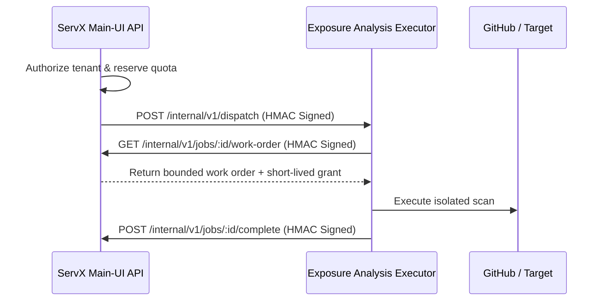

# Exposure Analysis Executor (Attack Paths)

> [!IMPORTANT]
> **Isolation Guarantee:** The Exposure Analysis Executor (formerly `servx-attackpaths`) operates as a strictly isolated microservice. It does not own users, repository definitions, job states, MongoDB connections, or long-lived GitHub credentials.

This microservice acts as the dedicated security scanning engine for ServX. It is entirely decoupled from the Main-UI API to ensure that broad cloud credentials and arbitrary user inputs never intersect with the remote scanning execution environment.

## Integration Architecture (HMAC Bridge)

The executor cannot be invoked via the browser or public API calls. Communication with the Main-UI API (the Control Plane) occurs exclusively over a bi-directional, HMAC-signed HTTPS bridge.

## Security & Resource Boundaries

- **Credential Isolation:** The executor receives an ephemeral, repository-scoped GitHub App installation token strictly for the duration of the scan. It is immediately purged upon completion.
- **Zero-Trust Endpoints:** All non-health endpoints (`/internal/v1/wake`, `/dispatch`, `/cancel`) rigorously validate the `X-ServX-Signature`. This signature is a SHA256 HMAC digest of the method, path, timestamp, nonce, and request body.
- **Stateless Execution:** The scanner relies on the Main-UI API for state persistence. It fetches a lease-bound job, normalizes the security evidence, returns the payload, and subsequently deletes its temporary filesystem workspace.

## Execution Profiles

| Profile | Purpose | Execution Environment |
|---------|---------|-----------------------|
| **`quick`** | Low-latency dependency and config checks. | Standby web service. |
| **`deep_repo`** | Comprehensive filesystem and IaC scanning (Semgrep, Trivy, Gitleaks). | Dedicated background worker with pinned Docker images. |
| **`verified_live`** | Active deployment scanning (Nuclei). | Paid, highly-isolated infrastructure. |

## Deployment Strategy

The executor is deployed in a physically distinct environment from the Main-UI API. It requires two distinct asymmetric HMAC secrets defined in its `.env` configuration:
- `ATTACK_PATHS_EXECUTOR_INBOUND_HMAC_SECRET`: Verifies incoming dispatches from the Control Plane.
- `ATTACK_PATHS_EXECUTOR_OUTBOUND_HMAC_SECRET`: Signs outgoing progress callbacks and result payloads.
