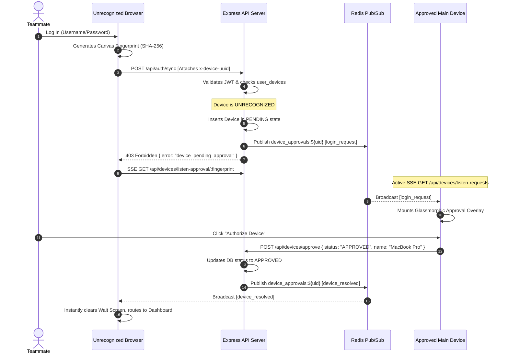

# Zero-Trust Device Approval System

This document specifies the technical design, database schemas, backend routing architectures, real-time Server-Sent Events (SSE) flows, and governance center components built to implement **device-level multi-factor authorization** in the ServX monorepo.

---

## 1. Overview & Security Architecture
Traditional session systems rely strictly on credentials (JWTs). If a token is compromised via XSS or session hijacking, malicious actors gain immediate access to connected repository secrets, database credentials, and production servers. 

The **Zero-Trust Device Approval System** blocks this attack vector. Every login attempt must present a valid, hardware-locked browser fingerprint (`x-device-uuid`). Unrecognized devices are immediately intercepted, placed in a `PENDING` quarantine state, and require real-time approval from an existing authorized `Main Device` before the API allows dashboard access.

---

## 2. Phase-by-Phase Technical Specifications

### Phase 1: Database Schema & Device Tracking (Supabase)
Persists device profiles and authorization statuses securely in Supabase.
*   **File Location:** [migration-supabase-devices.sql](file:///C:/vs/servx/supabase/migration-supabase-devices.sql)
*   **Schema & Fields (`public.user_devices`):**
    *   `id`: `UUID PRIMARY KEY DEFAULT gen_random_uuid()`
    *   `user_uuid`: `UUID REFERENCES auth.users(id) ON DELETE CASCADE`
    *   `device_fingerprint`: `TEXT NOT NULL`
    *   `device_name`: `TEXT NOT NULL`
    *   `is_main_device`: `BOOLEAN DEFAULT false`
    *   `status`: `public.device_status_type` ENUM (`'PENDING'`, `'APPROVED'`, `'DENIED'`)
    *   `last_ip`: `TEXT`
    *   `last_login`: `TIMESTAMPTZ`
*   **Constraints:** Compound key `UNIQUE(user_uuid, device_fingerprint)` guarantees that a single system signature cannot register multiple profiles under the same account.
*   **Indices:** Compound index `idx_user_devices_user_fingerprint` created on `(user_uuid, device_fingerprint)` for microsecond Express validation latency.
*   **Row Level Security (RLS) Isolation:**
    *   `SELECT / INSERT / UPDATE` access is limited strictly to `auth.uid() = user_uuid` to ensure users cannot view or manipulate device mappings for other accounts.

---

### Phase 2: Device Fingerprinting & Auth Middleware
Intercepts the standard Express sync-login flows using custom Axios headers and backend database checks.
*   **Frontend Axios Interceptor:** In [apiClient.ts](file:///C:/vs/servx/apps/web/src/lib/apiClient.ts), an interceptor calls `getDeviceUUID()` (canvas text-baseline overlay signature combined with browser characteristics) and dynamically injects the resulting SHA-256 fingerprint into the `x-device-uuid` HTTP header for all outbound requests.
*   **Backend Auth Interceptor (`POST /api/auth/sync`):**
    *   In [controller.ts](file:///C:/vs/servx/apps/api/src/domains/auth/controller.ts), the handler extracts `x-device-uuid` from headers.
    *   If absent: throws a `400` validation error.
    *   If device does not exist:
        *   Checks database count. If it is the user's first device, it auto-registers it as `'APPROVED'` and sets `is_main_device: true` to prevent initial onboarding lockouts (bootstrapping).
        *   If it is a subsequent device, it registers the device in a `'PENDING'` state, dispatches an SSE alert, and returns a `403` status with the code `device_pending_approval`.
    *   If device exists as `'PENDING'`: Updates activity timestamps, dispatches an SSE alert, and blocks access with `403 device_pending_approval`.
    *   If device exists as `'DENIED'`: Returns a `403` status with the code `device_denied`.
    *   If device exists as `'APPROVED'`: Allows the request to pass through to the core synchronizations.

---

### Phase 3: Real-Time Signaling (SSE / WebSockets)
Establishes lightning-fast real-time streams to connect approved pings and waiting devices without polling overhead.
*   **File Location:** [router.ts](file:///C:/vs/servx/apps/api/src/domains/devices/router.ts) & [controller.ts](file:///C:/vs/servx/apps/api/src/domains/devices/controller.ts)
*   **SSE Heartbeats & Buffering:** Incorporates `X-Accel-Buffering: no` headers to bypass aggressive Nginx proxy buffers and schedules a 15-second heartbeat loop to prevent cloud gateway cutoffs.
*   **SSE Streams:**
    *   `GET /api/devices/listen-requests`: Main approved devices listen here to hear real-time incoming login attempts (`login_request` event) mapped from Redis PubSub.
    *   `GET /api/devices/listen-approval/:fingerprint`: Unapproved waiting browsers connect here. The stream filters user-wide Redis PubSub messages and pushes the resolution payload (`device_resolved` event) when the target fingerprint matches.
*   **Device Actions (`POST /api/devices/approve`):**
    *   Invoked by main devices. Validates the fingerprint ownership, updates Supabase table properties (`status: 'APPROVED' | 'DENIED'`, custom device name), and publishes a JSON payload onto the user's channel `device_approvals:${userId}` to trigger the listening clients.

---

### Phase 4: Frontend - Governance Center UI Updates
Integrates active device auditing, custom names, and immediate real-time popups into the Governance Center.
*   **File Location:** [DataGovernance.tsx](file:///C:/vs/servx/apps/web/src/pages/DataGovernance.tsx)
*   **API & React Query Hooks:**
    *   Exposes Axios endpoints under [api.ts](file:///C:/vs/servx/apps/web/src/features/admin/api.ts).
    *   Implements `useDeviceList` Query, and `useRevokeDevice` & `useApproveDevice` mutations in [hooks.ts](file:///C:/vs/servx/apps/web/src/features/admin/hooks.ts), utilizing automatic cache invalidation to keep states in sync.
*   **SSE Request Overlay:** Uses an active EventSource connection in the background. If a new request is intercepted, a premium blur-backed glassmorphic modal slides into view, prompting the Owner to approve (with optional custom name, e.g., "Office MacBook") or deny the device immediately.
*   **Device Governance Section:** Renders a clean administration table listing connected devices, system characteristics, RLS statuses, IP locations, and trash icons to revoke access immediately.

---

### Phase 5: Frontend - The Login Interceptor (Upcoming)
*   **Objective:** Overhaul the central React login panel to handle zero-trust states.
*   **Workflow:**
    *   If the login api call returns `device_pending_approval`, transition the UI to a glassmorphic "Security Check" screen.
    *   Open an `EventSource` connection to `/api/devices/listen-approval/:fingerprint`.
    *   Render a dynamic spinner: *"Waiting for approval from your Main Device..."* with active Hardware ID watermark.
    *   When the SSE stream receives a `device_resolved` event with status `'APPROVED'`, immediately complete the session initialization and route the user to the core dashboards.

---

## 3. High-Performance / Security Hardening Decisions

1.  **JWT Fallback in requireAuth:**
    Standard browser `EventSource` connections do not support injecting custom HTTP headers (like `Authorization: Bearer <token>`). To bypass this limitations securely without widening auth walls:
    *   `requireAuth` was upgraded to fall back to `req.query.token` when the header is absent.
    *   The extracted token is cryptographically verified against standard Supabase User signatures and expiration dates before authorizing the SSE stream.
2.  **Redis Client Duplication:**
    When a Redis client enters Subscription mode (`client.subscribe()`), it is locked and cannot execute write commands. To prevent bottlenecks, the controller clones subscription nodes dynamically using `redis.duplicate()` and disconnects/cleans up listeners upon browser connection closings (`req.on('close')`), preventing thread leaks.
3.  **Real-Time Revocation:**
    When an owner clicks "Revoke Device" on the dashboard, the backend deletes the database record and publishes a `'DENIED'` resolution broadcast to the user's Redis PubSub channel. This forces any open session on the revoked browser to immediately lock down.
