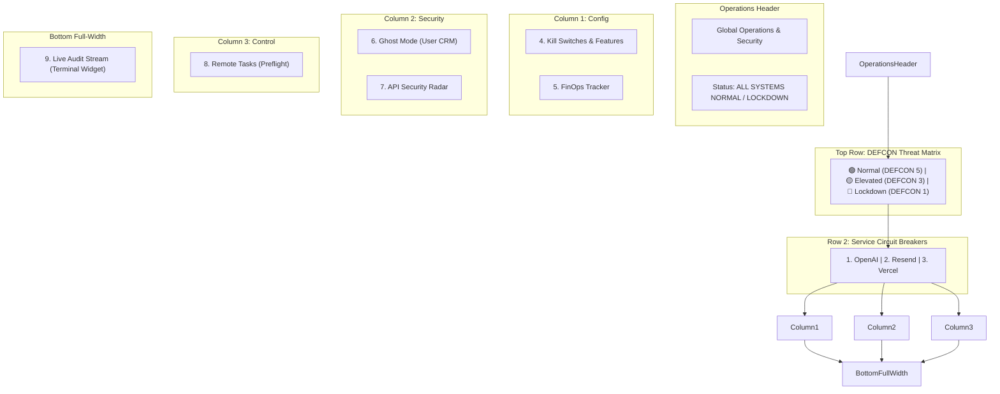
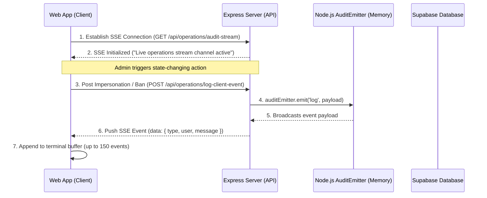

# Global Operations & Security

**Route:** `/operations`  
**Page File:** [index.tsx](file:///c:/VS/Servx/apps/web/src/features/operations/index.tsx)  
**Feature Root:** `apps/web/src/features/operations/`

The **Global Operations & Security** page is the high-density real-time command deck for administrators. It brings together global system threat defense mechanisms, cloud provider project selector toggles, database and cache operational tasks with real-time blast-radius metrics, simulated credential-impersonation toolsets (Ghost Mode), manual outbound service breakers, a client firewall IP bouncer, live FinOps cost projections, and a continuous stream of administrator activities.

---

## 🎨 Design Philosophy & Visual Aesthetic

The page uses a highly polished, modern design language that balances high data density with smooth micro-interactions.

### Interface Design Style: **Light Glassmorphism / Clean DevOps Control Room**
Unlike typical cyberpunk or dark neon dashboards, this interface leverages a premium, clean light-mode aesthetic. 

#### Key Visual Characteristics:
- **Soft Glass Cards (`glass-card`):** High-density control boxes featuring rounded corners (`rounded-xl`), crisp light-gray borders (`border-gray-200`), white backing (`bg-white/80`), subtle drop-shadows (`shadow-sm`), and soft backdrop blur filters (`backdrop-blur-md`).
- **State-based Accent Palettes:** System health states are color-coded to draw immediate focus:
  - **Green (Success/Active):** Systems normal state, baseline DEFCON indicators, toggle switches, and streaming channels.
  - **Red (Critical/Destructive):** Active system lockdowns, tripped circuit breakers, active maintenance alerts, IP bans, high-impact tasks, and abort functions.
  - **Yellow (Warning/Assess):** Elevated threat states, FinOps cost alerts, mid-tier task impacts, and computing-state indicators.
  - **Purple (Security/Auth):** Ghost-mode simulation controls and restricted admin tokens.
- **Dynamic Background Shifting:** Layout shifts from standard light gray backing (`bg-slate-50/30`) to a very soft crimson wash (`bg-red-50/20`) dynamically under active System Lockdown, signaling maximum security presence.
- **Visual Grid Structure:** Main dashboard layout is designed as a responsive, asymmetric three-column layout (`grid-cols-1 lg:grid-cols-3`) with auto-row scaling, culminating in a full-width terminal row at the bottom.

---

## 🔍 Interface Design Search Terms
If you are looking to search online platforms (like Dribbble, Behance, Pinterest, or Figma community templates) for design patterns, layouts, and visual assets similar to this interface, use these exact keywords:

* **"DevOps Command Center Dashboard UI"**
* **"Light Glassmorphic SaaS Admin Console"**
* **"NOC (Network Operations Center) Control Room UI"**
* **"High-Density System Monitoring Dashboard"**
* **"SaaS Infrastructure Control Panel Design"**
* **"Light Neumorphism/Glassmorphic Web App UI"**

---

## 🏗 Dashboard Layout & Widgets

The screen is organized into a top-level global console, a service health breaker grid, and five specialized modules alongside a full-width real-time logging terminal:

### 🛡️ The "DEFCON" Threat Matrix (Hero Widget)
* **Description:** A massive, full-width hero control element positioned at the very top of the operations page (`bg-white shadow-lg p-8 rounded-xl`).
* **Visual Segments:**
  - 🟢 **Normal (DEFCON 5 / 4):** Soft green accents. Baseline system operations.
  - 🟡 **Elevated (DEFCON 3 / 2):** Amber warning theme. Heightened security filters.
  - 🔴 **Lockdown (DEFCON 1):** Striking crimson red accents. Clicking this zone initiates a pulsing red card border and launches a dedicated confirmation dialog.
* **Lockdown Typed Confirmation:** Transitioning to Lockdown mode requires the admin to type `"LOCKDOWN"` inside a modal. 
* **Express Lockdown Middleware:** When Lockdown is active, a top-level Express middleware intercepts all inbound REST write operations (`POST`, `PUT`, `DELETE`) across the API and returns `403 Forbidden - System Lockdown`. The DEFCON adjustment route is whitelisted to prevent administrative lockout.
* **Hybrid Session Invalidation:** When Lockdown triggers, the backend updates a `global:jwt:valid_after` timestamp in Redis and broadcasts this payload via Pub/Sub. The authentication middleware decodes bearer JWT tokens on request receipt, parsing the `iat` (issued at) claim. Any active token issued before the lockdown timestamp is immediately invalidated, logging out old sessions without database lookups.
* **Redis Pub/Sub Syncing:** All running Express nodes subscribe to the `channel:defcon_updates` Redis channel on boot. Updates are published in real-time, instantly adjusting local in-process memory state variables to avoid latency.

### 🔌 Active Circuit Breakers Grid
* **Description:** A horizontal 3-column CSS Grid representing manual software circuit breakers wrapping outgoing third-party dependencies:
  - **OpenAI (Diagnosis Engine)**
  - **Resend (Transactional Mail)**
  - **Vercel (Deployment Router)**
* **State Values:**
  - 🟢 **Circuit Closed (Healthy):** Normal routing active. Outgoing API integrations fully operational.
  - 🔴 **Circuit Open (Tripped):** Outbound requests suspended. Local mock values/fallbacks are delivered.
* **Micro-Interactions:** Tripping a service triggers a localized skeleton loading block (`"Calculating impact..."` with a spinner) for 1.0 second before snapping state, allowing the system to verify connection dependencies before applying overrides.
* **Manual Software Bypass:** Before hitting outbound REST or SDK endpoints (e.g. OpenAI GPT diagnosis), the backend verifies the Redis Hash status (`HGET circuits openai`). If the hash returns `OPEN`, the outbound call is bypassed, throwing a custom `CircuitBreakerError` which invokes a fast, graceful local fallback rather than allowing the server thread to block or time out.

### 4. Kill Switches & Features
* **Project Selector:** Interactive dropdown to switch context between cloud provider environments (e.g. Vercel, Render) wrapped in provider badges (black Vercel triangle or emerald Render server icon).
* **Global Maintenance:** A high-impact switch that triggers `/operations/toggle-maintenance`. When activated, it transitions the card to a soft red alert state (`bg-red-50 border-red-200`) with an overlay pulsing glow, blocking all non-admin client traffic.
* **Feature Flags:** Simple visual toggles indicating availability for `Image Uploads`, `Beta AI Features`, and `New User Signups`.

### 5. FinOps Tracker
* A clean cost-tracking visualization containing the current month-to-date dollar spend, projected costs, and soft-capped threshold limit lines.
* Highlights over-budget situations through a pulsing `OVER LIMIT` warning badge and yellow progression indicators.

### 6. Ghost Mode (User CRM)
* **Administrative Impersonation:** Built for security engineers to safely mimic a user session. 
* Clicking **Impersonate** fires an asynchronous action simulating session token generation with a custom restricted banner ("Restricted Session Active (Audit Logged)"), logging the exact action directly to the security stream.

### 7. API Security Radar
* **IP Bouncer:** Active monitoring of inbound client IPs (DE, RU, US, local). Banned entries display structural line-through strikes with destructive badges.
* Admins can block suspicious actors instantly. Clicking the ban icon adds the host to the firewall rejection pool via the `ProjectContext` state and pushes a client event to the security logger.

### 8. Remote Tasks (Pre-Flight Runner)
* A sequential workflow engine designed to execute operational system actions:
  - **Force DB Backup** (Database snapshot task)
  - **Clear Redis Cache** (Cache flushing script)
  - **Sync GitHub Stats** (Repository analytics update)
* **Blast-Radius Assessment:** Clicking "Run Task" doesn't execute the script immediately. Instead, it initiates a 1.5s deliberate calculating pre-flight phase, hitting `/api/operations/tasks/assess` on the backend.
* **Color-Coded Pre-Flight Panels:** 
  - *High Impact (Clear Redis):* Renders red-tinted alert boxes (`border-red-200 bg-red-50/50`) detailing exactly how many downstream components are affected (e.g., 3 microservices) and warning of session losses.
  - *Medium Impact (Sync GitHub):* Renders orange-tinted alerts.
  - *Low Impact (Backup DB):* Renders blue-tinted alerts.
* Allows administrators to explicitly **Confirm & Run Task** or **Abort Action** based on visual metrics.

### 9. Live Audit Stream
* **Light-Themed Dev Terminal:** A terminal widget displaying real-time admin events.
* **Server-Sent Events (SSE):** Sustains a continuous connection to `/api/operations/audit-stream`. An indicator bar displays pulsing streaming signals (Green), reconnecting phases (Yellow), or disconnected states (Red).
* **Interactive Control Set:** Supports full-text copy-to-clipboard actions, live logs buffering clearing, stream freezing (Pause/Resume), and tag filter toggles (`all`, `security`, `task`, `maintenance`).
* **Blinking Cursor:** Includes a CSS-pulsing cursor indicator (` TERMINAL ACTIVE _`) mimicking classic console setups in a sleek modern design.

---

## ⚡ Data Flow & Real-Time SSE Architecture

The real-time synchronization is driven by **Server-Sent Events (SSE)**, creating a persistent, uni-directional stream from server to client with extremely low overhead.

### Key Endpoint Routings:
- **`GET /api/operations/projects`**  
  Retrieves active Vercel/Render deployments bound to the logged-in user.
- **`POST /api/operations/toggle-maintenance`**  
  Communicates with provider SDKs to swap proxy status, suspending or resuming direct traffic.
- **`GET /api/operations/defcon`**  
  Retrieves current in-memory DEFCON threat state.
- **`POST /api/operations/defcon`**  
  Sets the global DEFCON state, publishes updates to Redis Pub/Sub, and triggers JWT expiration.
- **`GET /api/operations/circuits`**  
  Fetches the active status of OpenAI, Resend, and Vercel circuit breakers.
- **`POST /api/operations/circuits/toggle`**  
  Manually trips or resets service circuit breaker state.
- **`POST /api/operations/tasks/assess`**  
  Assess script impact. Feeds the React component's pre-flight UI state machine with structured blast data.
- **`POST /api/tasks/execute`**  
  Runs the script in the background on the selected server cluster and triggers terminal updates.
- **`GET /api/operations/audit-stream`**  
  Initializes EventSource loop to stream logs generated by the express `auditEmitter` singleton.
- **`POST /api/operations/log-client-event`**  
  Fires custom frontend interactions (like IP ban/impersonation triggers) into the stream pipeline.

---

## 🔗 Related Documentation

* [Layout Shell & Navigation Component](../layout-shell.md)
* [Routing Layout Configurations](../routing.md)
* [Auto-Medic Integration Docs](./auto-medic.md)
* [API Endpoint Schemas](../../api/domain-operations.md)

